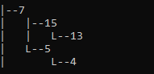
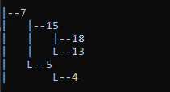
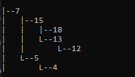
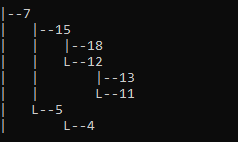
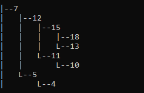
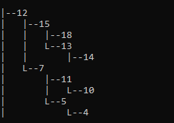

# Student Management System with AVL Tree

Проект реализует систему управления студентами с использованием AVL-дерева. 

## Содержание

- [Описание](#описание)
- [Функциональность](#функциональность)
- [Использование](#использование)
  - [Пример использования](#пример-использования)
- [Структура проекта](#структура-проекта)

## Описание

Проект представляет собой консольное приложение на C++, которое позволяет пользователю управлять информацией о студентах. Программа поддерживает добавление, поиск, удаление и вывод информации о студентах, используя AVL-дерево для хранения данных.

## Функциональность

- **Добавление студента**: Пользователь может добавить студента, указав номер студенческого билета, ФИО, курс, дату зачисления и контактную информацию. После каждого добавления отображается дерево для визуального наблюдением за балансировкой поддрев.
- **Вывод информации о студентах**: Пользователь может вывести информацию о всех студентах.
- **Удаление информации о студентах**: Пользователь может удалить информацию о всех студентах.
- **Поиск студента**: Пользователь может искать студента по номеру студенческого билета.
- **Удаление студента**: Пользователь может удалить студента по номеру студенческого билета.

## Использование

1. Склонируйте репозиторий:
    ```sh
    git clone <URL репозитория>
    ```
2. Перейдите в директорию проекта:
    ```sh
    cd <имя директории проекта>
    ```
3. Скомпилируйте проект:
    ```sh
    g++ -o main main.cpp AVL-TREE.cpp Student.cpp Node.cpp
    ```
4. Запустите программу:
    ```sh
    ./main
    ```

### Пример использования

1. Скомпилируйте и запустите программу:
    ```sh
    g++ -o main main.cpp AVL-TREE.cpp Student.cpp Node.cpp
    ./main
    ```
2. Следуйте инструкциям в меню:
    ```
     Меню:
    1) Добавление студента
    2) Вывод информации о студентах
    3) Удаление информации о студентах
    4) Поиск студента
    5) Удаление студента
    0) Выход из программы
    Выберите пункт меню: 1
    ```
3. Добавьте студента:
    ```
    Введите информацию о студенте:
    Введите номер студенческого:  7
    ФИО студента: Иванов Иван Иванович
    Курс: 3
    Дата зачисления: 01.09.2020
    Контактная информация: ivanov@example.com
    ```
4. Выведите информацию о всех студентах:
    ```
    Выберите пункт меню: 2
    ```
    Программа выведет информацию о всех студентах:
    ```
    Номер студенческого билета: 7
    ФИО студента: Иванов Иван Иванович
    Курс: 3
    Дата зачисления: 01.09.2020
    Контактная информация: ivanov@example.com
    ```

5. Найдите студента по номеру студенческого билета:
    ```
    Выберите пункт меню: 4
    Введите номер студенческого билета для поиска: 7
    ```
    Программа выведет информацию о студенте:
    ```
    Информация о студенте:
    Номер студенческого билета: 7
    ФИО студента: Иванов Иван Иванович
    Курс: 3
    Дата зачисления: 01.09.2020
    Контактная информация: ivanov@example.com
    ```

6. Удалите студента по номеру студенческого билета:
    ```
    Выберите пункт меню: 5
    Введите номер студенческого билета для удаления: 7
    ```

7. Удалите информацию о всех студентах:
    ```
    Выберите пункт меню: 3
    ```
#### Представление изменений в дереве
Видно, как после добавления вершин, сохраняется св-во: для каждой вершины высота её двух поддеревьев различается не более чем на 1.
#### Добавление номера 7                            
                
#### Добавление номера 5                            
                
#### Добавление номера 15

#### Добавление номера 4

#### Добавление номера 13

#### Добавление номера 18

#### Добавление номера 12

#### Добавление номера 11

#### Добавление номера 10

#### Добавление номера 14



## Структура проекта

- `Student.h` и `Student.cpp`: Определение и реализация структуры `Student`, представляющей студента.
- `Node.h` и `Node.cpp`: Определение и реализация структуры `Node`, представляющей узел AVL-дерева.
- `AVL-TREE.h` и `AVL-TREE.cpp`: Определение и реализация класса `AVLTree`, который управляет AVL-деревом.
- `main.cpp`: Основной файл программы, содержащий меню для взаимодействия с пользователем.

